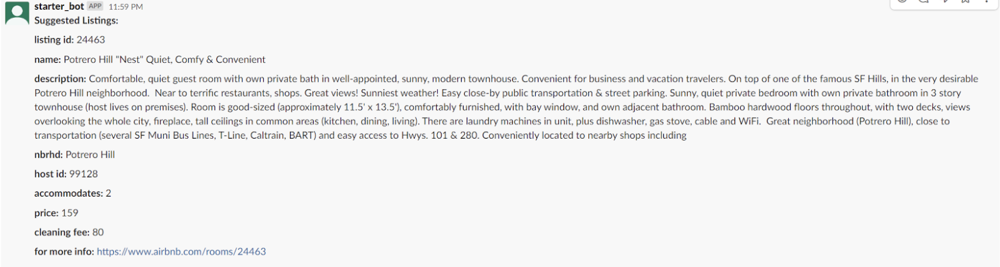
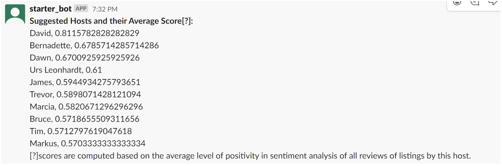
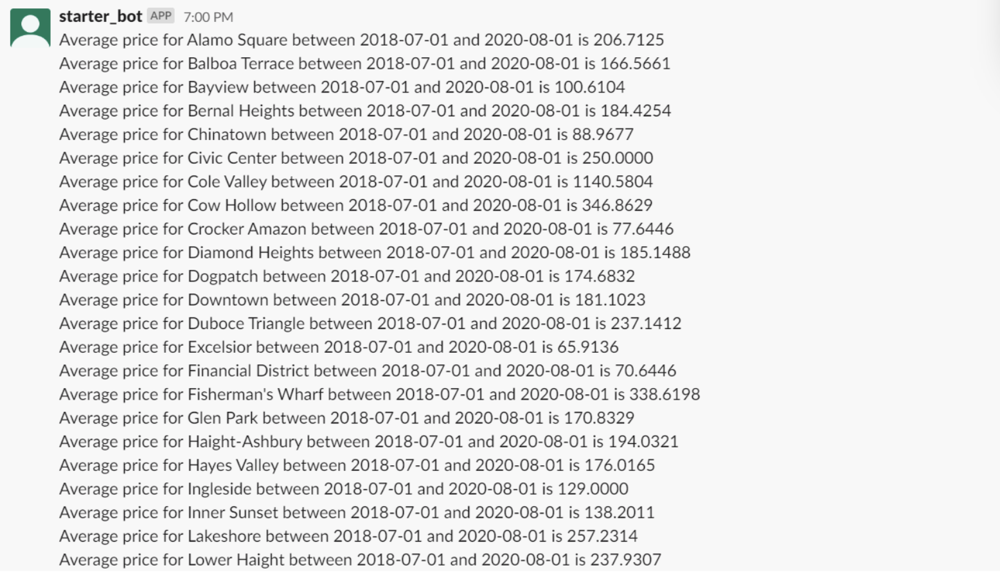
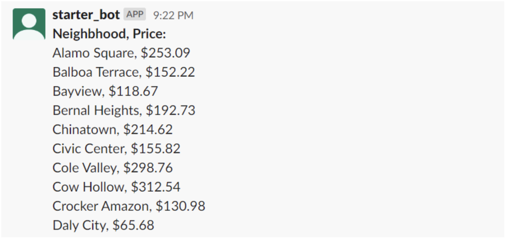
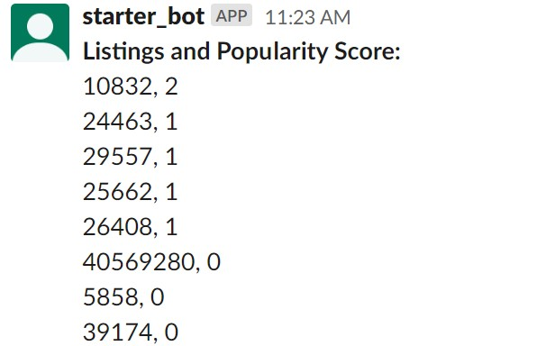
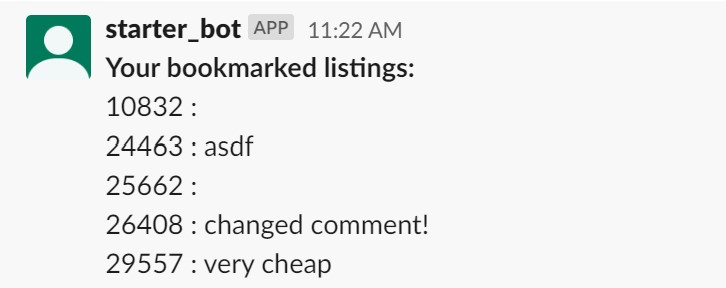
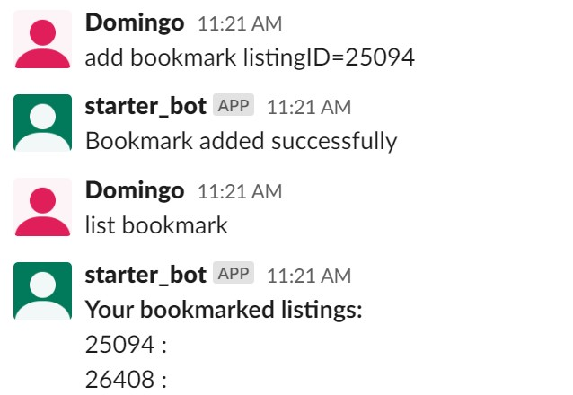
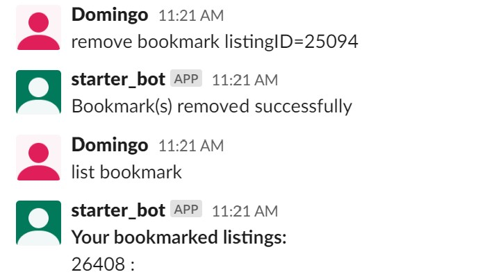

# CS 348 Project - Airbnb Slack Bot:
## Set up and Installation:
0. Download ngrok

1. Open one terminal (t1) and connect to our database instance (all the data should be populated already in the cloud database instance. The population of the dataset is done in `/data_acquisition/`) on gcp by running:
```
./cloud_sql_proxy -instances=cs348-m0:us-east1:cs348-m0=tcp:3306
```


2. Open another terminal (t2), activate python virtual environment and install the needed dependencies:
```
python3 -m venv venv
source venv/bin/activate
pip install -r requirements.txt
```


3. Start our django server by running the following command in t2, in directory: cs348-m0/slack: 
```
python manage.py runserver 0.0.0.0:8000
```

4. Open another terminal (t3) and tunnel our localhost:8000 to a public address by using ngrok:
```
./ngrok http 8000
```

5. From our ngrok in step 4, we have gotten this public address. Use this public address as the endpoint to Events Subscription in slack (will need access to slack account).

6. If the endpoint was verified, then we could start using this bot in our slack workspace (any channel that the slackbot is invited to).

## Slack Channel:
https://cs348airbnb.slack.com/

## Features implemented:
### User Interface
Users have multiple commands, a list is available if they type “help” to the bot. Our commands/features include the following:

`help`
Prints help document. File: `/slack/events/views.py`

`get listings`
Returns a list of listings. File: `/slack/queries/get_listings.py`
Usage:
```
get listings
get listings neighbourhood='downtown'
get listings numberOf=5
get listings neighbourhood='downtown' numberOf=5
```      


`list neighbourhood`
Returns a list of neighbourhoods. File: `/slack/queries/list_neighborhoods.py`

`suggest host <neighbourhood=''> <numberOf=''>`
Returns suggested hosts (and optionally within a neighbourhood or the top N). File: `/slack/queries/suggest_hosts.py`
Usage:
```
suggest host
suggest host neighbourhood='downtown'
suggest host numberOf=5
suggest host neighbourhood='downtown' numberOf=5
```      



`price date begin=' ' end=' ' <neighbourhood=''>`
Returns the average price within the date range (and optionally for one neighbourhood). File: `/slack/queries/avg_price.py`
Usage: 
```
price date begin='2018-07-01' end='2018-08-01' neighbourhood='downtown'
```


`price neighbourhood <neighbourhood>` 
Returns the average price in different neighbourhoods (or optionally, from one neighbourhood). File: `/slack/queries/price_neighborhoods.py`
Usage: 
```
price neighbourhood
price neighbourhood 'downtown'
```




`popular listings <num>`
Returns a list of <num> listings and their popularity score, ordered by their popularity score. File: `/slack/queries/list_popular_listings.py`
Usage:
```
popular listings
popular listings 5
```

      
`list bookmark`
Returns all of the user's *own* bookmarks. The user is the one who triggered the command. File: `/slack/queries/bookmark.py`
Usage:
```
list bookmark
```


`add bookmark listingID=' ' <comment=' '>`
Adds the listingID to the user's collection of bookmarks, along with an optional comment attached to this bookmark. File: `/slack/queries/bookmark.py`
Usage:
```
add bookmark listingID=123
add bookmark listingID=123 comment='very affordable!'
```


`remove bookmark <listingID=' '>`
Removes the specified listingID bookmark from user's *own* collection of bookmarks. If no listingID is specified, the entire collection is removed. File: `/slack/queries/bookmark.py`
Usage:
```
remove bookmark listingID=123
remove bookmark
```


To implement all of these, we also needed to create a parser for user commands. File: `/slack/module/parser.py`

Refer to tutorial: https://medium.com/freehunch/how-to-build-a-slack-bot-with-python-using-slack-events-api-django-under-20-minute-code-included-269c3a9bf64e
